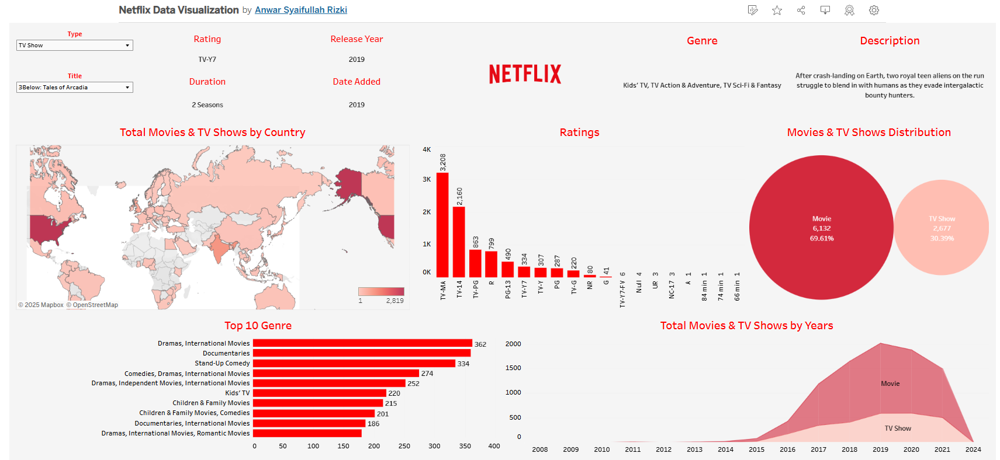

# 🎬 Netflix Data Visualization

📊 **Interactive Data Visualization using Tableau Public**

This project explores Netflix's data insights through interactive visualizations. The dashboard allows users to analyze trends, genres, and performance metrics of Netflix content over time.

🔗 **[View the Interactive Dashboard](https://public.tableau.com/views/NetflixDataVisualization_17368326379840/Netflix?:language=en-US&publish=yes&:sid=&:redirect=auth&:display_count=n&:origin=viz_share_link)**

## 📌 Project Overview
- **Tool Used**: Tableau Public  
- **Dataset**: Netflix Shows and Movies Dataset  
- **Analysis Focus**: Genre trends, release year distribution, and content ratings.

## 🖼️ Preview

## 🚀 How to View the Interactive Dashboard
1. Click the link above or open `index.html` for the embedded version.  
2. Explore the interactive visualizations and filters.

## 📚 Key Insights
- Total Movies & TV Shows by Country: The United States leads with the highest number of Netflix titles.
- Movies & TV Shows Distribution: Movies make up 69.61% of the total content, while TV shows account for 30.39%.
- Ratings Distribution: Majority of content is rated TV-MA and TV-14, highlighting diverse age-targeted content.
- Top 10 Genres: Drama, Documentaries, and Stand-Up Comedy are the most popular genres.
- Content Growth Over Years: Netflix's content grew significantly from 2015 to 2019, with a slight decline post-2020.

## 💡 Future Improvements
- Adding more datasets for deeper analysis.
- Integrating predictive analysis for future content trends.

## 📞 Contact
For any inquiries or collaborations, feel free to reach out:  
📧 anwars.rizki@gmail.com  
📱 https://www.linkedin.com/in/anwar-sr/

---
